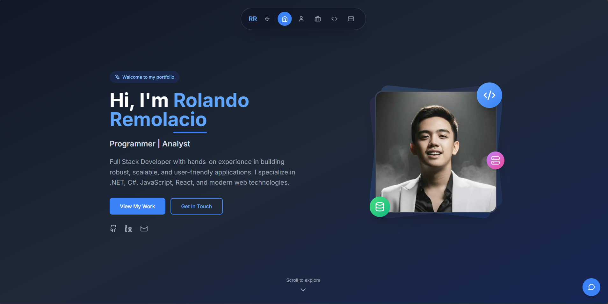

# Rolando Remolacio - Personal Portfolio

A modern, responsive portfolio website built with Next.js, React, Tailwind CSS, and an integrated AI assistant. This portfolio showcases my skills, projects, and experience as a full-stack developer.

## ✨ Features

- **Modern Design**: Clean, professional design with smooth animations
- **Responsive**: Fully responsive design that works on all devices
- **Interactive Sections**:
  - Hero section with animated elements
  - Timeline-based About section
  - Filterable projects gallery
  - Animated skills visualization
  - Contact form with validation
  - AI Assistant chatbot
- **SEO Optimized**: Comprehensive meta tags and OpenGraph support
- **Performance**: Optimized for Core Web Vitals and fast loading
- **Accessibility**: WCAG compliant with proper ARIA labels

## 🚀 Tech Stack

- **Framework**: Next.js 14 with App Router
- **Frontend**: React 18, TypeScript
- **Styling**: Tailwind CSS, Framer Motion
- **Components**: Custom components with Heroicons
- **Form Handling**: React Hook Form
- **Deployment**: Vercel (ready)
- **AI Integration**: Simple chatbot with predefined responses

## 📦 Installation & Setup

### Prerequisites

- Node.js 18+ 
- npm, yarn, or pnpm
- Git

### 1. Clone the Repository

\`\`\`bash
git clone https://github.com/paynuj1099/rolando-remolacio-portfolio.git
cd portfolio
\`\`\`

### 2. Install Dependencies

\`\`\`bash
npm install
# or
yarn install
# or
pnpm install
\`\`\`

### 3. Environment Variables

Copy the example environment file and configure your variables:

\`\`\`bash
cp .env.example .env.local
\`\`\`

Edit `.env.local` with your values:

\`\`\`env
# Site Configuration
NEXT_PUBLIC_SITE_URL=http://localhost:3000
NEXT_PUBLIC_SITE_NAME="Your Name Portfolio"
NEXT_PUBLIC_SITE_DESCRIPTION="Your professional description"

# Optional: Email Service (for contact form)
EMAILJS_SERVICE_ID=your_emailjs_service_id
EMAILJS_TEMPLATE_ID=your_emailjs_template_id
EMAILJS_PUBLIC_KEY=your_emailjs_public_key

# Optional: Analytics
NEXT_PUBLIC_GA_ID=your_google_analytics_id
\`\`\`

### 4. Add Your Content

#### Profile Image
- Add your profile photo to `public/images/profile.jpg`
- Recommended size: 400x400px or larger (square aspect ratio)

#### Project Images
- Add project screenshots to `public/images/projects/`
- Update project data in `components/Projects.tsx`

#### Personal Information
Update the following files with your information:
- `components/Hero.tsx` - Name, bio, social links
- `components/About.tsx` - Timeline data, story, stats  
- `components/Projects.tsx` - Project details and links
- `components/Skills.tsx` - Skills and proficiency levels
- `components/Contact.tsx` - Contact information
- `components/Footer.tsx` - Social links and bio

### 5. Run Development Server

\`\`\`bash
npm run dev
# or
yarn dev
# or
pnpm dev
\`\`\`

Open [http://localhost:3000](http://localhost:3000) to view your portfolio.

## 🎨 Customization

### Colors & Theme

The color scheme is defined in `tailwind.config.js`. You can customize:

\`\`\`javascript
colors: {
  primary: {
    // Customize these colors to match your brand
    50: '#eff6ff',
    500: '#3b82f6',
    600: '#2563eb',
    // ... add your color palette
  }
}
\`\`\`

### Content & Sections

Each section is a separate component in the `components/` directory:

- **Hero**: `components/Hero.tsx` - Landing section
- **About**: `components/About.tsx` - Timeline and background
- **Projects**: `components/Projects.tsx` - Project showcase
- **Skills**: `components/Skills.tsx` - Skills visualization
- **Contact**: `components/Contact.tsx` - Contact form and info
- **AI Assistant**: `components/AIAssistant.tsx` - Chatbot widget

### AI Assistant

The AI assistant uses predefined responses. To enhance it:

1. **Free Options**:
   - Keep current predefined responses (no API needed)
   - Use Hugging Face Inference API (free tier)
   - Implement OpenAI-compatible local models

2. **Paid Options**:
   - OpenAI GPT API
   - Anthropic Claude API
   - Google Gemini API

Update `components/AIAssistant.tsx` to integrate your chosen AI service.

## 🚀 Deployment

### Vercel (Recommended)

1. Push your code to GitHub
2. Connect your repository to [Vercel](https://vercel.com)
3. Configure environment variables in Vercel dashboard
4. Deploy automatically on every push

### Other Platforms

- **Netlify**: Push to GitHub and connect to Netlify
- **AWS Amplify**: Follow AWS Amplify deployment guide
- **Docker**: Use the included Dockerfile

### Custom Domain

After deployment:
1. Purchase a domain from your preferred registrar
2. Configure DNS settings in your platform (Vercel/Netlify)
3. Update `NEXT_PUBLIC_SITE_URL` environment variable

## 📊 Performance & SEO

### Built-in Optimizations

- **Next.js Image Optimization**: Automatic image optimization and lazy loading
- **Font Optimization**: Google Fonts with `next/font`
- **Bundle Analysis**: Run `npm run analyze` to check bundle size
- **SEO Tags**: Comprehensive meta tags and OpenGraph data
- **Sitemap**: Auto-generated sitemap for search engines

### Performance Tips

1. **Images**: Optimize images before uploading (use WebP format)
2. **Bundle Size**: Keep dependencies minimal
3. **Core Web Vitals**: Monitor with Lighthouse and PageSpeed Insights

### SEO Checklist

- ✅ Meta titles and descriptions
- ✅ OpenGraph and Twitter cards
- ✅ Structured data (JSON-LD)
- ✅ Sitemap and robots.txt
- ✅ Mobile-friendly design
- ✅ Fast loading speed

## 🔧 Development Commands

\`\`\`bash
# Development
npm run dev          # Start development server
npm run build        # Build for production
npm run start        # Start production server
npm run lint         # Run ESLint
npm run type-check   # Run TypeScript checks

# Deployment
npm run export       # Export static site
npm run analyze      # Analyze bundle size
\`\`\`

## 🤝 Contributing

1. Fork the repository
2. Create a feature branch (\`git checkout -b feature/AmazingFeature\`)
3. Commit your changes (\`git commit -m 'Add some AmazingFeature'\`)
4. Push to the branch (\`git push origin feature/AmazingFeature\`)
5. Open a Pull Request

## 📝 License

This project is licensed under the MIT License - see the [LICENSE](LICENSE) file for details.

## 🆘 Support & Contact

If you have questions or need help customizing this portfolio:

- **Email**: rolandojrremolacio@gmail.com
- **LinkedIn**: [linkedin.com/in/rolando-remolacio](https://www.linkedin.com/in/rolando-remolacio)
- **GitHub**: [github.com/paynuj1099](https://github.com/paynuj1099)

## 🙏 Acknowledgments

- [Next.js](https://nextjs.org/) - React framework
- [Tailwind CSS](https://tailwindcss.com/) - Utility-first CSS
- [Framer Motion](https://www.framer.com/motion/) - Animation library
- [Heroicons](https://heroicons.com/) - Beautiful icons
- [Vercel](https://vercel.com/) - Hosting and deployment

---

Made with ❤️ by [Rolando Remolacio](https://rolando-remolacio-portfolio.vercel.app)